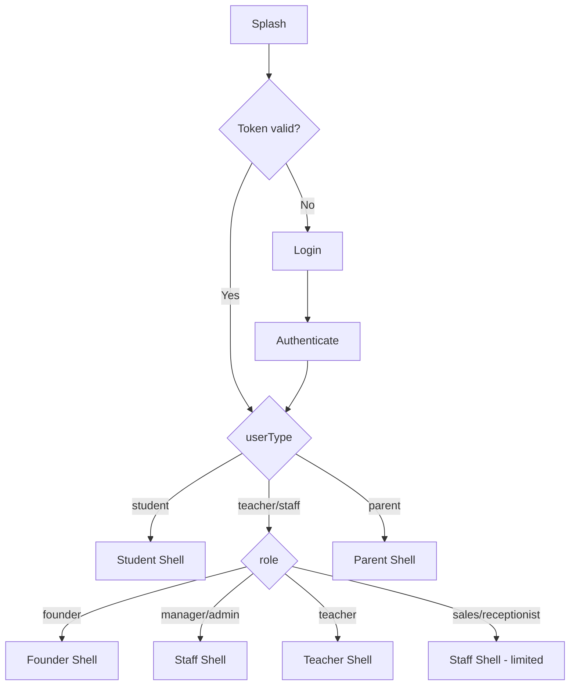
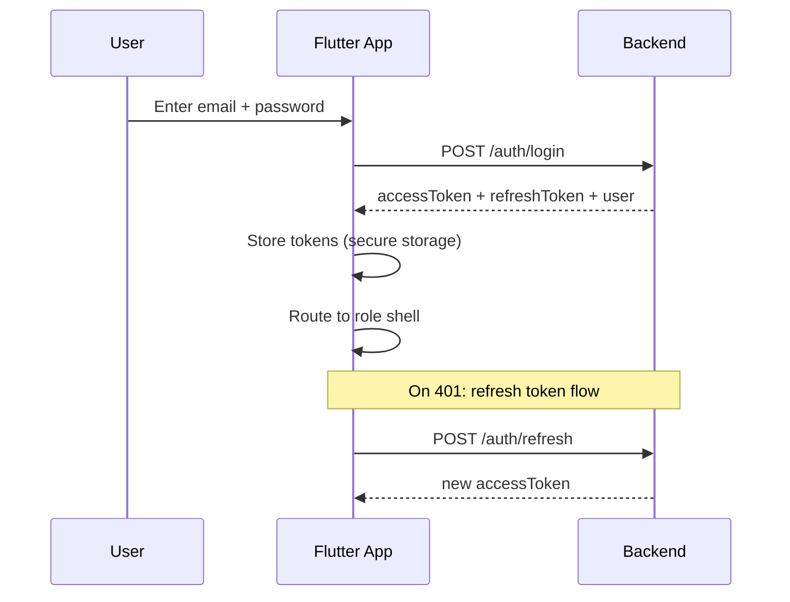
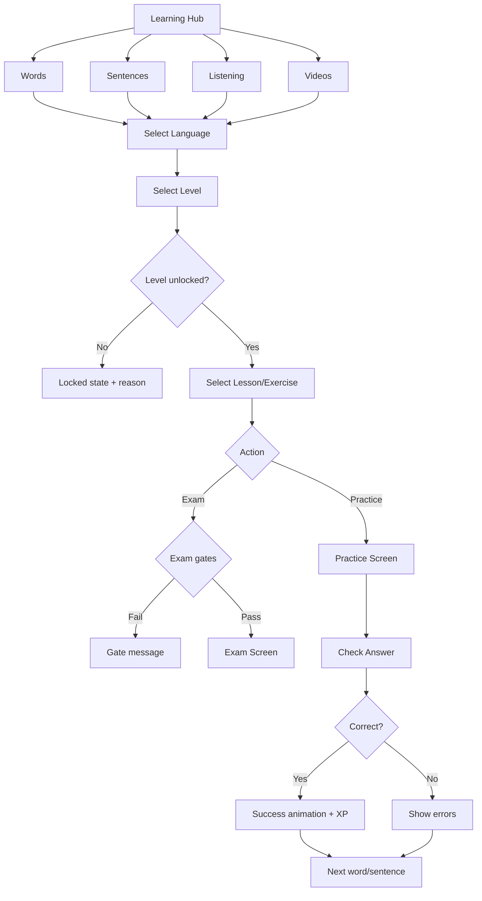
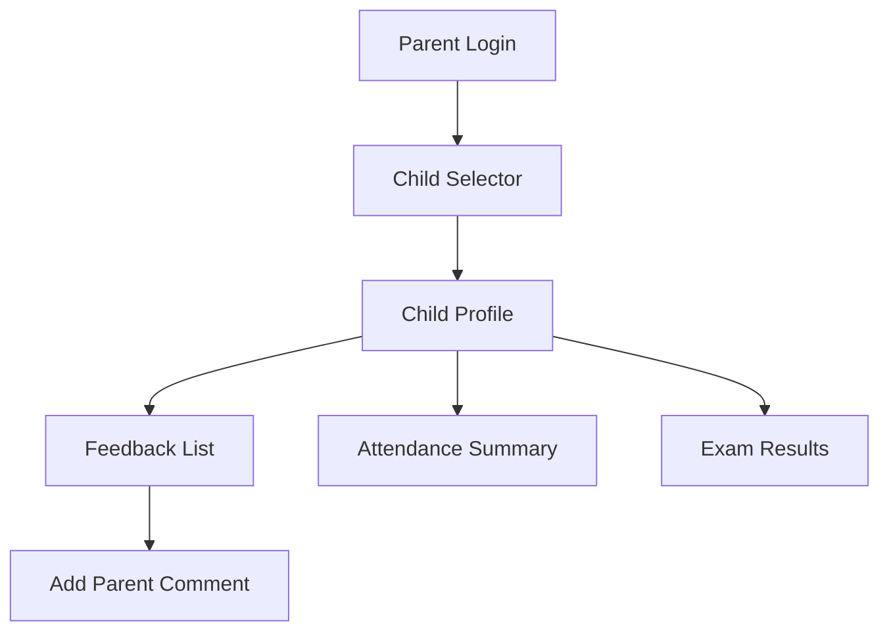

# Phase 7 — Navigation Flows

All flows are **mobile-first**. Desktop uses the same routes with adaptive layouts (rail + split panes).

---

## 1. Global App Flow



---

## 2. Authentication Flow



### Login screen behavior

- Single screen with email/password (no web-style tabs)
- Role auto-detected from credentials
- Optional "Staff login" / "Student login" toggle for explicit endpoint
- Biometric unlock (future) after first login

---

## 3. Founder Navigation

### Bottom nav (mobile) / Rail (desktop)

| # | Tab | Route | Screens |
|---|-----|-------|---------|
| 1 | Home | `/founder/dashboard` | Multi-branch stats, quick actions |
| 2 | Branches | `/founder/branches` | List → Detail → Create/Edit |
| 3 | People | `/founder/people` | Teachers, Students (all branches) |
| 4 | Learning | `/learning` | CMS hub (all modules) |
| 5 | More | `/founder/more` | Finance, Competition, Recycle Bin, Settings |

### Founder-specific flows

```
Dashboard
  → Tap branch card → Branch detail stats
  → Tap "Create branch" → Branch form → Success

Branches
  → List (all) → Search/filter
  → Tap branch → Detail (staff count, students, revenue)
  → Toggle active/inactive → Confirm dialog

Recycle Bin
  → Filter by module/collection
  → Tap item → Preview snapshot
  → Restore → Undo toast
  → Purge → Confirm "DELETE" if mass
```

---

## 4. Manager / Admin Navigation

### Bottom nav

| # | Tab | Route | Condition |
|---|-----|-------|-----------|
| 1 | Home | `/admin/dashboard` | Always |
| 2 | People | `/admin/people` | canViewStudents |
| 3 | Schedule | `/admin/schedule` | canViewScheduler |
| 4 | Learning | `/learning` | canManageHomework |
| 5 | More | `/admin/more` | Finance, Exams, Settings |

### Admin flows

```
People → Students
  → List (search, filter status)
  → Tap student → Profile tabs: Info | Attendance | Progress | Payments
  → FAB: Add student
  → Swipe actions: Deactivate

Schedule → Groups
  → Unified create: Subject + Group + Schedule (one form)
  → Tap group → Students | Sync schedule

Learning → Exam Control
  → Select module → Level/Lesson
  → Toggle practice/exam unlock per group (chip toggles)

Revenue
  → Summary cards → Chart → Export PDF
```

---

## 5. Teacher Navigation

### Bottom nav

| # | Tab | Route |
|---|-----|-------|
| 1 | Home | `/teacher/dashboard` |
| 2 | Classes | `/teacher/classes` |
| 3 | Attendance | `/teacher/attendance` |
| 4 | Learning | `/learning` (if permission) |
| 5 | Profile | `/teacher/profile` |

### Teacher flows

```
Classes (today)
  → Tap class → Actions sheet
    → Mark attendance (time-window check)
    → Submit feedback (sliders 0-100)
    → View enrolled students

Attendance
  → Today's classes list
  → Tap class → Student list → Mark present/absent
  → Warning if outside time window

Feedback
  → Select class → Rate homework/behavior/participation
  → Exam day toggle → Enter exam %
  → Submit → Parent notification triggered

My Earnings
  → Pending | Approved | Paid tabs
  → Tap item → Detail (read-only)
```

---

## 6. Student Navigation

### Bottom nav

| # | Tab | Route | Inactive allowed |
|---|-----|-------|------------------|
| 1 | Home | `/student/dashboard` | ✓ |
| 2 | Learn | `/learning` | ✗ (guard) |
| 3 | Schedule | `/student/timetable` | ✓ |
| 4 | Progress | `/student/progress` | ✗ |
| 5 | Profile | `/student/profile` | ✓ |

### Inactive student guard

```
On route to /learning/* or /student/progress
  → if status == inactive
  → Redirect to dashboard with banner:
    "Account inactive. Contact administration."
  → Allowed: dashboard, results, feedback, payments
```

---

## 7. Learning Hub Flow (All Student Roles)



---

## 8. Words Module Flow

```
Learning Hub → Words
  → Language grid (cards with progress %)
  → Level list (lock badges per group)
  → Lesson list (status: locked | available | passed)
  → Tap lesson → Bottom sheet:
      [Practice] [Exam] [Leaderboard]

Practice:
  → Direction toggle (EN→UZ / UZ→EN)
  → Word card (large typography, not web flashcard clone)
  → Text input + Submit
  → Instant feedback (correct/incorrect + meanings)
  → Streak counter + accuracy update
  → Swipe or tap "Next"

Exam:
  → Pre-check gates:
      1. In class hours? (UTC+5)
      2. Group unlocked?
      3. Already attempted today?
  → Timer countdown (examTimeLimit)
  → Question sequence (one at a time, progress dots)
  → Submit → Score screen
  → Pass (≥70%): unlock animation for next lesson
  → Fail: retry tomorrow message

Leaderboard:
  → Top 10 list
  → Sticky "Your rank" row if outside top 10
```

---

## 9. Sentences Module Flow

```
Learning Hub → Sentences
  → Same hierarchy as Words
  → Practice:
      → Show English sentence (or Uzbek based on direction)
      → Multi-line text input
      → Submit → Grammar analysis sheet:
          - Error chips (wrongWord, missingArticle, etc.)
          - Similarity score ring
          - Vocabulary breakdown
      → Correct: confetti + XP
  → Leaderboard (accuracy primary, totalCorrect tie-breaker)
```

---

## 10. Listening Module Flow

```
Learning Hub → Listening
  → Language → Level → Exercise list
  → Practice screen:
      → Audio player (play/pause, seek, ±5s, progress bar)
      → Text input for transcription
      → Submit → Tier result card:
          - failed (<70%): "Try again" — no missing words
          - partial (70-89%): show missing words
          - passed (≥90%): full pass + XP
  → No script ever displayed
```

---

## 11. Video Module Flow

```
Learning Hub → Videos
  → Grid of video cards (thumbnail, watch %, lock state)
  → Tap unlocked video → Player screen
      → YouTube embedded player
      → Watch progress tracked (monotonic)
      → At 70%: "Completed" badge
  → Topic Test button:
      → Practice mode: always available
      → Exam mode: requires watchPercent ≥ 70%
  → Test screen:
      → Timer (if configured)
      → Question types: MCQ, T/F, fill-blank
      → Anti-cheat: app lifecycle listener → warning count
      → 3 warnings → terminated
  → Results → Best score saved
```

---

## 12. Competition Flow (Staff)

```
More → Competition
  → Tabs: Penalties | Presentations | Bonuses

Penalties:
  → Select student → Type picker → Points × Quantity → Submit
  → Monthly view → Leaderboard by penalty points
  → Swipe to revert

Presentations:
  → Select student → Score slider (1-10) → Date → Submit

Bonuses:
  → Select month → Calculate preview (40/30/30 split)
  → Select 1st and 2nd place students
  → Distribute → Confirmation
```

---

## 13. Parent Flow (Future-Ready)



Minimal navigation — no sidebar, no learning modules.

---

## 14. CMS Flow (Staff with Permissions)

```
Learning (staff mode) → Content Manager
  → Module picker: Words | Sentences | Listening | Video
  → Hierarchy browser (tree or breadcrumb)
  → CRUD actions via bottom sheets / forms
  → Bulk import: Camera OCR | DOCX file picker
  → Exam Control: group unlock matrix
  → Student Progress: filter by group → drill to student
```

---

## 15. Deep Link Routes (`go_router`)

| Route | Params | Role |
|-------|--------|------|
| `/login` | — | Public |
| `/student/dashboard` | — | Student |
| `/learning/words/practice/:lessonId` | direction | Student |
| `/learning/words/exam/:lessonId` | — | Student |
| `/learning/sentences/practice/:lessonId` | — | Student |
| `/learning/listening/:exerciseId` | — | Student |
| `/learning/video/:videoId` | — | Student |
| `/learning/video/:videoId/test` | mode | Student |
| `/admin/students/:id` | — | Admin |
| `/teacher/classes/:scheduleId/attendance` | — | Teacher |
| `/founder/branches/:id` | — | Founder |
| `/notifications` | — | All |

---

## 16. Modal & Sheet Patterns

| Action | Pattern |
|--------|---------|
| Confirm delete | Dialog with typed confirmation for mass delete |
| Filter/sort | Bottom sheet |
| Quick actions | FAB → speed dial |
| Grammar analysis | Draggable bottom sheet (sentences) |
| Gate blocked | Inline card with reason + icon |
| Success | Snackbar + optional Lottie overlay |
| Offline | Top banner + queue indicator |

---

*Next: [UI Wireframes](./07-UI-WIREFRAMES.md)*
